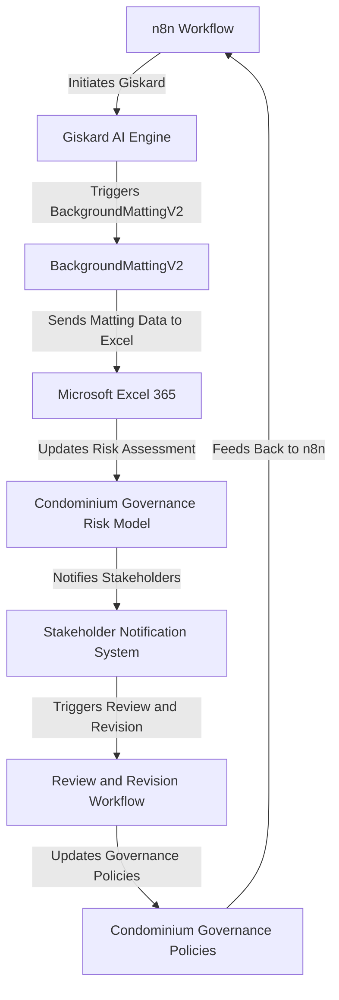

# Condominium Governance Risk Navigator
> "Navigating the labyrinthine complexities of condominium governance, where risk mitigation and proactive decision-making converge in a symphony of technological innovation and human expertise."

## 🏗️ Technical Architecture & Multi-Agent Flow

This intricate dance of technologies and processes underscores the sophistication of the Condominium Governance Risk Navigator, where each component seamlessly interacts to mitigate risks and optimize governance.

## 🔍 The Vertical Bottleneck: Inadequate Risk Assessment and Proactive Governance
The condominium governance sector is plagued by a plethora of complexities, including inadequate risk assessment, inefficient communication, and reactive decision-making. These bottlenecks can lead to catastrophic consequences, such as financial losses, reputational damage, and decreased stakeholder trust. The technical friction arises from the lack of integration between disparate systems, inadequate data analysis, and insufficient use of artificial intelligence and machine learning.

The high-stakes mathematical and operational failures in condominium governance can be attributed to the inability to effectively assess and mitigate risks. This is often due to the reliance on manual processes, inadequate data analysis, and the lack of proactive decision-making. The consequences of these failures can be severe, resulting in significant financial losses, damage to reputation, and decreased stakeholder trust.

Furthermore, the condominium governance sector is characterized by a complex web of stakeholders, including residents, property managers, and governing boards. Effective communication and collaboration among these stakeholders are crucial to ensuring proactive governance and risk mitigation. However, the lack of integrated systems and inadequate data analysis can hinder this communication, leading to misunderstandings, miscommunication, and ultimately, poor decision-making.

## 💡 The Solution: Condominium Governance Risk Navigator
The Condominium Governance Risk Navigator is a cutting-edge platform that orchestrates n8n, Giskard, BackgroundMattingV2, and Microsoft Excel 365 to provide a comprehensive risk assessment and proactive governance solution. This platform leverages agentic reasoning, memory persistence via Letta/MemEngine, and tool calling to provide a seamless and integrated experience.

The Condominium Governance Risk Navigator utilizes n8n to initiate workflows, Giskard to provide AI-driven insights, BackgroundMattingV2 to analyze data, and Microsoft Excel 365 to update risk assessments and governance policies. This integrated approach enables proactive decision-making, effective communication, and collaborative governance.

## 🧩 Agentic Stack Deep-Dive
The Condominium Governance Risk Navigator's agentic stack is comprised of n8n, Giskard, BackgroundMattingV2, and Microsoft Excel 365. n8n provides the workflow orchestration, Giskard offers AI-driven insights, BackgroundMattingV2 analyzes data, and Microsoft Excel 365 updates risk assessments and governance policies.

The integration of these technologies is seamless, with each component interacting with the others to provide a comprehensive solution. n8n initiates workflows, which trigger Giskard to provide AI-driven insights. These insights are then analyzed by BackgroundMattingV2, and the results are sent to Microsoft Excel 365 to update risk assessments and governance policies.

## ✨ Capabilities & Features
* **Risk Assessment**: The Condominium Governance Risk Navigator provides a comprehensive risk assessment framework, leveraging AI-driven insights and data analysis to identify potential risks and mitigate them proactively.
* **Proactive Governance**: The platform enables proactive governance, facilitating effective communication and collaboration among stakeholders to ensure informed decision-making.
* **Integrated Workflows**: The Condominium Governance Risk Navigator integrates workflows, leveraging n8n to initiate and manage workflows, and Giskard to provide AI-driven insights.
* **Data Analysis**: The platform utilizes BackgroundMattingV2 to analyze data, providing actionable insights to inform decision-making.
* **Microsoft Excel 365 Integration**: The Condominium Governance Risk Navigator integrates with Microsoft Excel 365, enabling seamless updates to risk assessments and governance policies.
* **Stakeholder Notification**: The platform provides stakeholder notification, ensuring that all stakeholders are informed and engaged throughout the governance process.
* **Review and Revision**: The Condominium Governance Risk Navigator facilitates review and revision, enabling stakeholders to review and revise governance policies and risk assessments.
* **Governance Policy Management**: The platform provides governance policy management, enabling stakeholders to manage and update governance policies effectively.
* **Compliance Management**: The Condominium Governance Risk Navigator offers compliance management, ensuring that all governance policies and risk assessments are compliant with regulatory requirements.
* **Reporting and Analytics**: The platform provides reporting and analytics, enabling stakeholders to track and analyze governance metrics and risk assessments.

## 🛠️ Technical Implementation
The Condominium Governance Risk Navigator is built using a microservices architecture, with each component interacting with the others to provide a comprehensive solution. The platform leverages containerization, using Docker to containerize each component, and Kubernetes to orchestrate the containers.

The technical implementation is divided into several components, including:
* **n8n Workflow**: The n8n workflow is responsible for initiating and managing workflows, leveraging the n8n API to interact with other components.
* **Giskard AI Engine**: The Giskard AI engine provides AI-driven insights, leveraging machine learning algorithms to analyze data and provide actionable insights.
* **BackgroundMattingV2**: BackgroundMattingV2 analyzes data, leveraging computer vision algorithms to extract insights from images and videos.
* **Microsoft Excel 365 Integration**: The Microsoft Excel 365 integration enables seamless updates to risk assessments and governance policies, leveraging the Microsoft Excel 365 API to interact with the platform.

## 📊 Business Impact & ROI
The Condominium Governance Risk Navigator has a significant impact on the condominium governance sector, providing a comprehensive risk assessment and proactive governance solution. The platform enables stakeholders to make informed decisions, mitigate risks, and optimize governance.

The return on investment (ROI) for the Condominium Governance Risk Navigator is substantial, with the platform providing a significant reduction in risk, improved governance, and increased stakeholder trust. The platform also enables stakeholders to reduce costs, improve efficiency, and enhance overall performance.

## 🚀 Getting Started
```bash
git clone https://github.com/arvind-sundararajan/condo-governance-risk-navigator.git
cd condo-governance-risk-navigator
pip install -r requirements.txt
python src/main.py
```

## 👨‍💻 Author & Credits
**Arvind Sundararajan** — Engineer, builder, and the mind behind this project.
🌐 [LinkedIn](https://www.linkedin.com/in/arvind-sundara-rajan/) | Chennai, India

---
### 🙏 Acknowledgements
- The open-source community
- The Managing residential condominiums practitioners who inspired this design